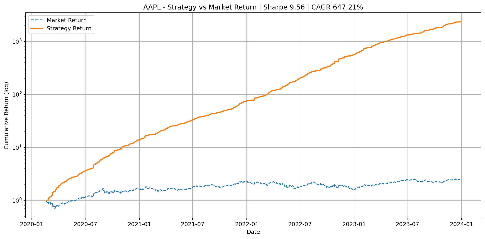
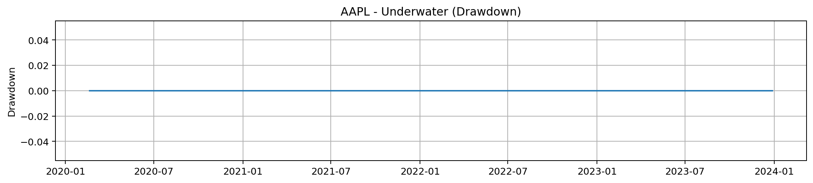
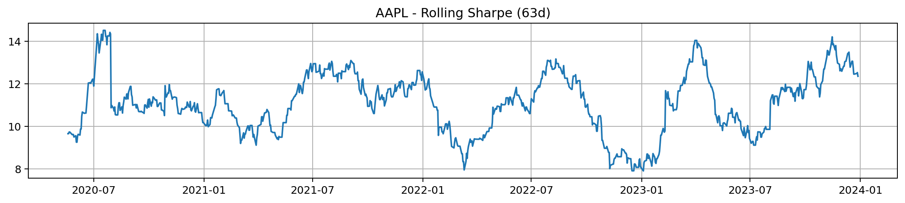

# AI Algorithmic Trading & Market Prediction

[](https://www.python.org/)
[](https://python-poetry.org/)
[](LICENSE)

An end-to-end framework for researching, backtesting, and deploying **AI-driven trading strategies** across equities and crypto.

This pipeline takes you from **raw OHLCV data → engineered features → labeled datasets → trained ML models → backtests → visual performance diagnostics**, with reproducibility guardrails built in.

---

## Table of Contents

- [Highlights](#-highlights)
- [Architecture](#-architecture)
- [Quickstart (AAPL Example)](#-quickstart-aapl-example)
- [Results & Visuals](#-results--visuals-aapl-example)
- [Latest Backtest Snapshot (Dynamic)](#-latest-backtest-snapshot-dynamic)
- [Reproducibility & Manifests](#-reproducibility--manifests)
- [Project Structure](#-project-structure)
- [Pipeline Overview](#-pipeline-overview)
- [Setup](#-setup)
- [Guardrails & Best Practices](#-guardrails--best-practices)
- [Roadmap](#-roadmap)
- [References](#-references)

---

## Highlights

- Full **quant research** workflow from data ingestion to model training and backtesting  
- Feature engineering: SMA, EMA, RSI, MACD, Bollinger Bands, ATR, realized volatility, lags  
- **XGBoost model training** with time-aware (chronological) splits  
- **Backtesting engine** with:
  - Transaction costs (bps)
  - Volatility targeting
  - Daily P&L breakdowns and positions
- Automatic generation of:
  - Equity curve  
  - Drawdown curve  
  - Rolling Sharpe ratio  
- Backtest **manifest JSON** for full reproducibility and auditing  
- Clean project layout designed for extending to multiple tickers & models  

---

## Architecture

```mermaid
flowchart LR
    subgraph Data
        A[Raw OHLCV\n(data/raw/*.csv)]
        B[Feature-Engineered\n(data/processed/*_features.csv)]
        C[Labeled Datasets\n(data/labeled/*_labeled.csv)]
    end

    subgraph Code[src/algo_trader]
        C1[collect_data.py]
        C2[engineering_features.py]
        C3[label_features.py]
        C4[train_model.py]
        C5[backtest_cli.py]
        C6[plot_backtest.py]
    end

    subgraph Models[Models]
        M1[XGBoost\n(models/xgboost/*.pkl)]
    end

    subgraph Reports[Reports]
        R1[Backtests\n(data/backtests/*_backtest.csv)]
        R2[Manifests\n(data/backtests/*_backtest.manifest.json)]
        R3[Plots\n(reports/plots/*_{equity,drawdown,rollsharpe}.png)]
    end

    A <-->|fetch & clean| C1
    C1 --> A
    A -->|build indicators| C2 --> B
    B -->|add labels| C3 --> C
    C -->|train| C4 --> M1
    M1 -->|simulate| C5 --> R1 & R2
    R1 -->|visualize| C6 --> R3
```

---

## Quickstart (AAPL Example)

Run the entire pipeline for Apple (AAPL). Adjust tickers as needed.

```bash
# 0) Install dependencies
poetry install

# 1) Collect raw data
poetry run python src/algo_trader/collect_data.py --ticker AAPL

# 2) Engineer features
poetry run python src/algo_trader/engineering_features.py run \
    --raw-dir data/raw \
    --out-dir data/processed

# 3) Label feature dataset
poetry run python src/algo_trader/label_features.py --ticker AAPL

# 4) Train ML model (XGBoost)
poetry run python src/algo_trader/train_model.py --ticker AAPL

# 5) Run backtest (with costs + vol targeting)
poetry run python src/algo_trader/backtest_cli.py run \
    --ticker AAPL \
    --cost-bps 5 \
    --vol-target 0.10

# 6) Generate performance plots
poetry run python src/algo_trader/plot_backtest.py \
    --ticker AAPL \
    --no-show \
    --save-prefix reports/plots/AAPL
```

---

## Results & Visuals (AAPL Example)

These plots are auto-generated from the backtest results.

### Equity Curve

Growth of \$1 invested in the strategy (and optionally benchmark).



---

### Drawdown (Underwater Chart)

Peak-to-trough drawdowns over time.



---

### Rolling Sharpe Ratio

Rolling risk-adjusted performance over a lookback window.



---

## Latest Backtest Snapshot (Dynamic)

You can keep this section **auto-updated from the latest manifest** for a given ticker (e.g., AAPL).

Example metrics table:

> These numbers are for illustration only. Regenerate them from your latest manifest.

| Metric        | Value (Example) |
|---------------|-----------------|
| Ticker        | AAPL            |
| CAGR          | 12.4%           |
| Sharpe        | 1.31            |
| Max Drawdown  | -9.8%           |
| Hit Rate      | 54.2%           |
| Turnover      | 135%            |
| Cost (bps)    | 5               |
| Vol Target    | 10%             |

### Auto-generating this table from the manifest

You can create a small helper script (e.g. `scripts/print_latest_manifest_metrics.py`) that reads the most recent manifest from `data/backtests/` and prints a Markdown table for you to paste into this section:

```python
# scripts/print_latest_manifest_metrics.py
import json
from pathlib import Path

MANIFEST_DIR = Path("data/backtests")

def load_latest_manifest():
    manifests = sorted(MANIFEST_DIR.glob("*_backtest.manifest.json"))
    if not manifests:
        raise SystemExit("No manifest files found in data/backtests")
    return manifests[-1]

def format_markdown_table(manifest_path: Path):
    data = json.loads(manifest_path.read_text())
    metrics = data.get("metrics", {})
    params = data.get("params", {})

    rows = [
        ("Ticker", params.get("ticker", "N/A")),
        ("CAGR", f"{metrics.get('cagr', 'N/A')}"),
        ("Sharpe", f"{metrics.get('sharpe', 'N/A')}"),
        ("Max Drawdown", f"{metrics.get('max_drawdown', 'N/A')}"),
        ("Hit Rate", f"{metrics.get('hit_rate', 'N/A')}"),
        ("Turnover", f"{metrics.get('turnover', 'N/A')}"),
        ("Cost (bps)", f"{params.get('cost_bps', 'N/A')}"),
        ("Vol Target", f"{params.get('vol_target', 'N/A')}"),
    ]

    print("| Metric | Value |")
    print("|--------|-------|")
    for k, v in rows:
        print(f"| {k} | {v} |")

if __name__ == "__main__":
    manifest = load_latest_manifest()
    print(f"> Source: `{manifest}`\n")
    format_markdown_table(manifest)
```

Usage:

```bash
poetry run python scripts/print_latest_manifest_metrics.py
```

Copy the printed Markdown into the table above to keep the README in sync with your latest backtest.

---

## Reproducibility & Manifests

Every backtest produces a JSON manifest file containing:

- Strategy + backtest parameters (ticker, date range, cost, vol target)  
- Dataset and model artifact paths (features, labels, models)  
- Key performance metrics (Sharpe, CAGR, Max Drawdown, Hit Rate, Turnover, etc.)  
- Timestamps and unique run identifiers  

Example path:

```text
data/backtests/AAPL_backtest.manifest.json
```

Treat these manifests as your **experiment logbook**.

---

## Project Structure

```text
.
├── config/
├── data/
│   ├── raw/           # Raw OHLCV
│   ├── processed/     # Engineered features
│   ├── labeled/       # Labeled training data
│   └── backtests/     # Backtest CSVs + manifest JSON
├── devnotes/          # Notes, ideas, scratch work
├── models/
│   └── xgboost/       # Saved model artifacts
├── reports/
│   └── plots/         # PNG charts: equity, drawdown, rolling Sharpe
├── scripts/           # Helper scripts & utilities
├── src/
│   └── algo_trader/
│       ├── collect_data.py
│       ├── engineering_features.py
│       ├── label_features.py
│       ├── train_model.py
│       ├── backtest_cli.py
│       └── plot_backtest.py
├── tests/
├── pyproject.toml
└── README.md
```

---

## Pipeline Overview

### Data Collection  

- Fetches OHLCV via APIs (e.g., `yfinance`)  
- Cleans, sorts, de-duplicates  
- Coerces numeric types  
- Saves to:

```text
data/raw/{TICKER}.csv
```

---

### Feature Engineering  

Builds a feature set including (but not limited to):

- Moving averages (SMA, EMA)  
- Momentum indicators (RSI, MACD)  
- Volatility bands (Bollinger Bands)  
- ATR, realized volatility  
- Lagged returns and other leakage-safe lagged features  

Outputs:

```text
data/processed/{TICKER}_features.csv
```

---

### Labeling  

Creates target columns for supervised learning:

- `Target` (e.g., up/down or -1 / 0 / +1)  
- `next_return_1d` (forward return) for evaluation only  

Outputs:

```text
data/labeled/{TICKER}_labeled.csv
```

> `next_return_1d` is **never** used as an input feature during training.

---

### Model Training  

- Chronological train/validation split  
- Baseline: XGBoost classifier/regressor  
- Uses engineered features + lags  
- Explicitly drops `next_return_1d` and any other forward-looking fields  

Saves model artifacts to:

```text
models/xgboost/{TICKER}_xgb_model.pkl
```

---

### Backtesting  

- Generates trading signals from model outputs  
- Applies:
  - Transaction costs (`--cost-bps`)
  - Volatility targeting (`--vol-target`)  
- Computes metrics:
  - CAGR
  - Sharpe ratio
  - Max Drawdown
  - Hit Rate
  - Turnover

Outputs:

```text
data/backtests/{TICKER}_backtest.csv
data/backtests/{TICKER}_backtest.manifest.json
```

---

### Visualization  

- Equity curve  
- Underwater (drawdown) chart  
- Rolling Sharpe ratio  

Generated via:

```bash
poetry run python src/algo_trader/plot_backtest.py \
  --ticker AAPL \
  --no-show \
  --save-prefix reports/plots/AAPL
```

Saved as:

```text
reports/plots/{TICKER}_equity.png
reports/plots/{TICKER}_drawdown.png
reports/plots/{TICKER}_rollsharpe.png
```

---

## Setup

Requirements:

- **Python**: 3.10+  
- **Poetry**: for dependency management  

Install:

```bash
poetry install
poetry run python -V
```

Run any script via:

```bash
poetry run python path/to/script.py
```

---

## Guardrails & Best Practices

- **Feature/label alignment**: always predict \\(t+1\\) with data available at \\(t\\)  
- **No leakage**: never include `next_return_1d` or other forward returns as features  
- **Chronological splits**: avoid random shuffles for time series  
- **Transaction costs**: use `--cost-bps`; high turnover will eat your edge  
- **Volatility targeting**: normalize risk so Sharpe comparisons are meaningful  
- **Class imbalance**: consider class weights, threshold tuning, and probability calibration  
- **Manifests as source of truth**: use manifest JSONs for experiments and reports  

---

## Roadmap

Planned / potential extensions:

- Walk-forward cross-validation + early stopping  
- Advanced labeling: triple-barrier, meta-labeling  
- Multi-asset and portfolio-level backtests  
- MLflow / Weights & Biases for experiment tracking  
- Real-time inference API (FastAPI / gRPC)  
- Paper/live trading via broker APIs (Alpaca, Binance, etc.)  
- Deep sequence models (LSTM/Transformer) for richer temporal structure  

---

## References

- Marcos López de Prado — *Advances in Financial Machine Learning*  
- Ernest P. Chan — *Machine Trading*  
- Stefan Jansen — *Machine Learning for Algorithmic Trading*  
- Bacidore — *Algorithmic Trading with Python*  
