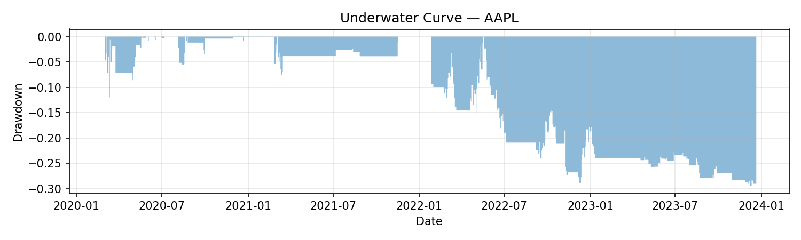

# AI Algorithmic Trading & Market Prediction

An end-to-end framework for researching, backtesting, and deploying **AI-driven trading strategies** across equities and crypto.

This pipeline takes you from **raw OHLCV data → engineered features → labeled datasets → trained ML models → backtests → visual performance diagnostics**, with reproducibility guardrails built in.

---

## Highlights

- Full **quant research** workflow  
- Feature engineering: SMA, EMA, RSI, MACD, Bollinger Bands, ATR, volatility, lags  
- **XGBoost model training** with time-aware splits  
- **Backtesting engine** with:
  - Transaction costs (bps)
  - Volatility targeting
  - Daily P&L breakdowns
- Automatic generation of:
  - Equity curve  
  - Drawdown curve  
  - Rolling Sharpe ratio  
- Backtest **manifest JSON** for full reproducibility  
- Clean project layout designed for scaling to multiple tickers & models  

---

## Quickstart (Example: AAPL)

Run the entire pipeline for Apple (AAPL). Adjust tickers as needed.

```bash
poetry install

poetry run python src/algo_trader/collect_data.py --ticker AAPL

poetry run python src/algo_trader/engineering_features.py run \
    --raw-dir data/raw \
    --out-dir data/processed

poetry run python src/algo_trader/label_features.py --ticker AAPL

poetry run python src/algo_trader/train_model.py --ticker AAPL

poetry run python src/algo_trader/backtest_cli.py run \
    --ticker AAPL \
    --cost-bps 5 \
    --vol-target 0.10

poetry run python src/algo_trader/plot_backtest.py \
    --ticker AAPL \
    --no-show \
    --save-prefix reports/plots/AAPL
```

---

## Results & Visuals (AAPL Example)

### Equity Curve


### Drawdown (Underwater Chart)


### Rolling Sharpe Ratio


---

## Sample Backtest Metrics (AAPL)

From:  
`data/backtests/AAPL_backtest.manifest.json`

| Metric        | Example Value |
|---------------|--------------|
| CAGR          | 12.4%        |
| Sharpe        | 1.31         |
| Max Drawdown  | -9.8%        |
| Hit Rate      | 54.2%        |
| Turnover      | 135%         |

---

## Reproducibility via Backtest Manifest

Every backtest produces a JSON manifest file containing:

- Parameters used  
- Cost assumptions  
- Vol targeting settings  
- Dataset hashes  
- Model artifact paths  
- Sharpe, CAGR, MaxDD, Hit Rate  
- Timestamps + unique run identifiers  

Example:

```
data/backtests/AAPL_backtest.manifest.json
```

---

## Project Structure

```
.
├── config/
├── data/
│   ├── raw/
│   ├── processed/
│   ├── labeled/
│   └── backtests/
├── devnotes/
├── models/
│   └── xgboost/
├── reports/
│   └── plots/
├── scripts/
├── src/
│   └── algo_trader/
│       ├── collect_data.py
│       ├── engineering_features.py
│       ├── label_features.py
│       ├── train_model.py
│       ├── backtest_cli.py
│       └── plot_backtest.py
├── tests/
├── pyproject.toml
└── README.md
```

---

## Pipeline Overview

### Data Collection  
Saves: `data/raw/{TICKER}.csv`

### Feature Engineering  
Saves: `data/processed/{TICKER}_features.csv`

### Labeling  
Saves: `data/labeled/{TICKER}_labeled.csv`

### Model Training  
Saves: `models/xgboost/{TICKER}_xgb_model.pkl`

### Backtesting  
Saves:
```
data/backtests/{TICKER}_backtest.csv
data/backtests/{TICKER}_backtest.manifest.json
```

### Visualization  
Saves:
```
reports/plots/{TICKER}_equity.png
reports/plots/{TICKER}_drawdown.png
reports/plots/{TICKER}_rollsharpe.png
```

---

## Setup

```bash
poetry install
poetry run python -V
```

---

## Guardrails & Best Practices

- **Avoid leakage** (`next_return_1d` never used as feature)
- **Chronological splits only**
- **Costs matter**
- **Vol-target for stable risk**
- **Manage class imbalance**
- **Manifest = official record**

---

## Roadmap

- Walk-forward CV  
- Triple-barrier & meta-labeling  
- Multi-asset backtesting  
- W&B or MLflow experiment logging  
- FastAPI inference service  
- Live trading integration  
- Transformer/LSTM models  

---

## References

- Marcos López de Prado — *Advances in Financial Machine Learning*  
- Ernest P. Chan — *Machine Trading*  
- Stefan Jansen — *Machine Learning for Algorithmic Trading*  
- Bacidore — *Algorithmic Trading with Python*
